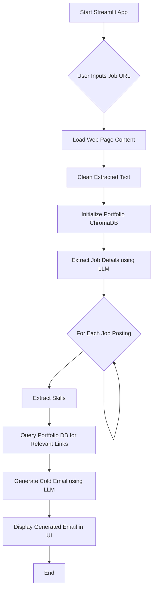

# Cold Email Generator

This project is a **Cold Email Generator** application designed to automate the process of creating personalized cold emails for job applications. By simply providing a URL to a job posting, the application extracts relevant information, identifies required skills, matches them with a pre-defined portfolio, and generates a tailored cold email showcasing your or your company's capabilities.

---

## ✨ Features

* **Job Posting Extraction**: Automatically scrapes and extracts job details (role, experience, skills, description) from provided URLs.
* **Skill-to-Portfolio Matching**: Queries a local ChromaDB vector store to find relevant portfolio links based on the skills required in the job description.
* **Personalized Cold Email Generation**: Utilizes a Large Language Model (LLM) to craft compelling cold emails, incorporating job details and relevant portfolio links.
* **Streamlit User Interface**: Provides an intuitive and easy-to-use web interface for inputting URLs and viewing generated emails.

---

## 🛠️ Technologies Used

* **Python**
* **Streamlit**: For creating the interactive web application.
* **LangChain**: For orchestrating LLM interactions, prompt management, and data extraction.
* **Groq**: As the LLM provider (specifically `llama-3.1-70b-versatile`).
* **ChromaDB**: For local vector storage of portfolio data.
* **Pandas**: For handling and loading portfolio data from CSV.
* **BeautifulSoup4 / `WebBaseLoader`**: For web scraping.
* **`python-dotenv`**: For managing environment variables (API keys).

---

## 🚀 Getting Started

Follow these steps to set up and run the Cold Email Generator locally.

### Prerequisites

* Python 3.8+
* `pip` (Python package installer)

### Installation

1.  **Clone the repository:**

    ```bash
    git clone [https://github.com/Naveen-DS08/Generative_AI.git](https://github.com/Naveen-DS08/Generative_AI.git)
    cd Generative_AI/Cold_e-mail_Generator
    ```

2.  **Create a virtual environment (recommended):**

    ```bash
    python -m venv venv
    source venv/bin/activate  # On Windows use `venv\Scripts\activate`
    ```

3.  **Install the dependencies:**

    You'll need a `requirements.txt` file. Please create one with the following content:

    ```
    streamlit
    langchain
    langchain-core
    langchain-community
    langchain-groq
    chromadb
    pandas
    python-dotenv
    beautifulsoup4
    ```

    Then install:

    ```bash
    pip install -r requirements.txt
    ```

### Configuration

1.  **Groq API Key**:
    Obtain an API key from [Groq](https://console.groq.com/keys).
    Create a `.env` file in the root directory of your project (same level as `main.py`) and add your Groq API key:

    ```
    GROQ_API_KEY="your_groq_api_key_here"
    ```

2.  **Portfolio Data**:
    The `portfolio.py` file expects a CSV file named `my_portfolio.csv` at the path `app/resourse/my_portfolio.csv`.
    Create the directories `app/resourse` if they don't exist, and place your `my_portfolio.csv` file inside.
    The CSV should have at least two columns: `Techstack` (for skills/technologies) and `Links` (for corresponding portfolio links).

    Example `my_portfolio.csv`:

    ```csv
    Techstack,Links
    Python,[https://example.com/python-project-1](https://example.com/python-project-1)
    Machine Learning,[https://example.com/ml-showcase](https://example.com/ml-showcase)
    Data Science,[https://example.com/data-portfolio](https://example.com/data-portfolio)
    Web Development,[https://example.com/web-dev-site](https://example.com/web-dev-site)
    ```

### Running the Application

1.  **Navigate to the project directory** (if you're not already there):

    ```bash
    cd Generative_AI/Cold_e-mail_Generator
    ```

2.  **Run the Streamlit application:**

    ```bash
    streamlit run main.py
    ```

    This will open the application in your web browser, typically at `http://localhost:8501`.

---

## 📈 Workflow

The application follows a sequential workflow to generate cold emails:



## 📂 Project Structure

```
├── .env
├── main.py
├── components/
│   ├── __init__.py
│   └── helper.py
├── data/
│   ├── raw/
│   │   └── data.csv
│   └── processed/
│       └── cleaned_data.pkl
├── README.md
└── requirements.txt
```

## 📞 Contact
For any questions or suggestions, feel free to reach out to Naveen Babu - "https://www.linkedin.com/in/naveen-babu-8s96/".
